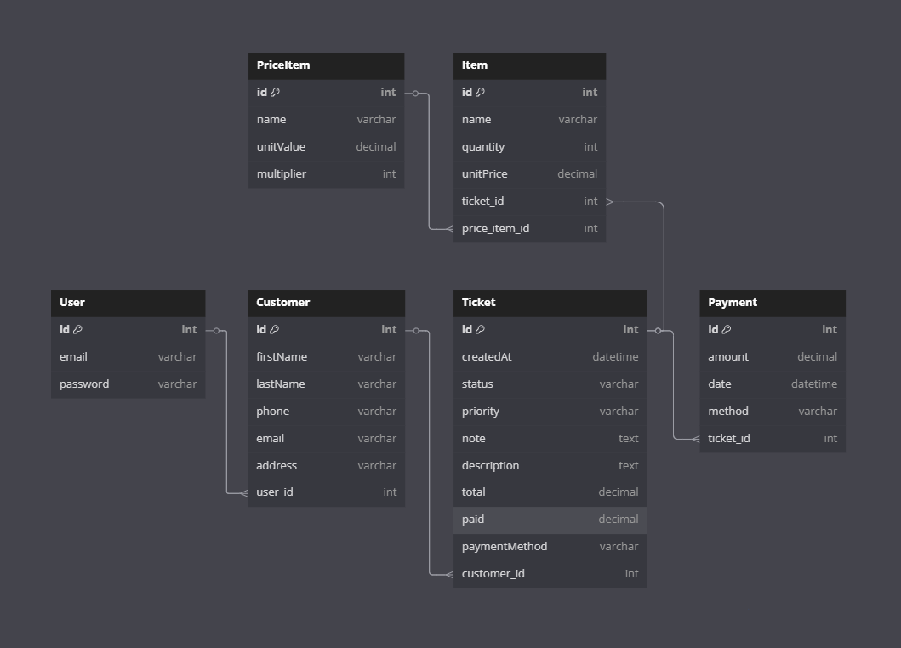

# 🧺 Autosplash

**Autosplash** is a platform designed to digitize and simplify laundry business operations. It allows you to register wash tickets, manage customers, track payment history, and generate PDF receipts — all from a modern and user-friendly interface.

---

## 🔐 Demo Account

You can test the app using the following credentials:

- **Email:** editor.autosplash@gmail.com  
- **Password:** admin123

---

## ✨ Key Features

- Create wash tickets with automatic PDF receipt generation.
- Customer management: create, edit, and view customers.
- Payment tracking with history and automatic balance calculation.
- Price calculator based on item categories.
- View orders by status and monitor delayed tickets.
- Dashboard with statistics and graphs.
- JWT authentication and user system.
- Optional image upload and QR code for ticket tracking.
- Internal notes per ticket.
- Responsive design optimized for mobile devices.

---

## 🛠️ Tech Stack

### 🖥️ Frontend
- Vite + React + TypeScript
- Tailwind CSS
- React Router
- Axios
- Sonner (notifications)
- date-fns (date formatting)
- Chart.js

### 🧠 Backend
- Node.js + Express
- MongoDB (Mongoose)
- JWT (authentication)
- Firebase Cloud Messaging (push notifications)
- PDFKit (receipt generation)
- Cloudinary (optional for images)
- Winston (logging)
- Express-validator (validations)
- Morgan (request logger)

---

## 🚀 Probar en local

Para probar el frontend (y la app completa) en tu máquina:

### 1. Backend (obligatorio para login y datos)

El frontend llama a una API. Necesitás tener el backend corriendo:

```bash
cd autosplash-be
npm install
cp .env.example .env
# Completar .env (MongoDB, JWT, etc.)
npm run dev
```

Dejá esta terminal abierta. Anotá en qué URL corre (ej: `http://localhost:3001`).

### 2. Frontend

En **otra terminal**:

```bash
cd autosplash-fe
npm install
cp .env.example .env
```

Abrí el archivo `.env` y configurá la URL del backend:

```env
VITE_API_URL=http://localhost:3001
```

(Reemplazá el puerto si tu backend usa otro, por ejemplo `http://localhost:4000`.)

Luego:

```bash
npm run dev
```

Vite va a levantar el frontend (por defecto en **http://localhost:5173**). Abrí esa URL en el navegador.

### 3. Iniciar sesión

Usá la cuenta de prueba:

- **Email:** editor.autosplash@gmail.com  
- **Password:** admin123  

---

## ⚙️ Installation (desarrollo desde cero)

### Clonar los repos

```bash
# Frontend
git clone https://github.com/frcampero/autosplash-fe.git
cd autosplash-fe

# Backend (en otra carpeta)
git clone https://github.com/frcampero/autosplash-be.git
```

### Backend

```bash
cd autosplash-be
npm install
cp .env.example .env
# Configurar variables (MongoDB, JWT, etc.)
npm run dev
```

### Frontend

```bash
cd autosplash-fe
npm install
cp .env.example .env
# En .env: VITE_API_URL=http://localhost:3001 (o el puerto de tu backend)
npm run dev
```

---

## 🔗 Backend Repository

You can check the backend code here:  
👉 [autosplash-be](https://github.com/frcampero/autosplash-be)

---

## 📄 Screenshots


---

## 🧠 Entity Relationship Diagram (ERD)

This is the database structure used by Autosplash:



---

## 📦 Project Status

🚧 In development — Currently used by a real-world laundry shop. Coming soon:
- Dashboard filters by date range.
- Photo upload when creating a ticket.

---

## 💼 Why this project matters?

This project was built as a real solution to replace Excel spreadsheets in a laundry business. It showcases fullstack development, UI/UX design, database management, security, and dynamic PDF generation.

---

## 🧠 Author

Federico Campero  
📫 [fcampero.dev](mailto:fcampero.dev)
